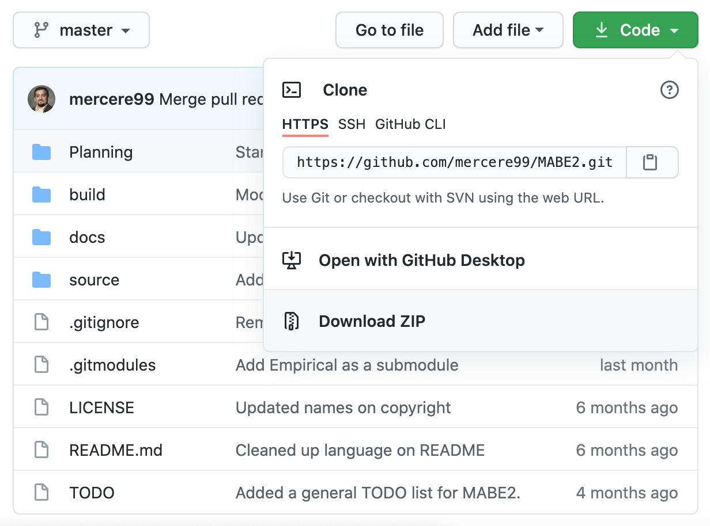

============
Installation
============

Installing Git
==============

Before attempting to install MABE2 **you must have Git installed so that you 
can use the MABE2 software on your local computer**. For information on installing 
Git on any device, see `this guide <https://github.com/git-guides/install-git#:~:text=Git%20packages%20are%20available%20using%20dnf%20.,installation%20by%20typing%3A%20git%20version%20.>`_.

The first steps for installation on any machine is to visit MABE2 on  
`GitHub <https://github.com/mercere99/MABE2>`_. The simplest way to 
download source code form GitHub is to download the entire repository. 
From the repository's main page, find the green *Code* button in the upper
right hand corner. Click this button, then click *DownLoad Zip* to save the 
full zip of everything in MABE2's master branch to your computer. 

For more information about GitHub, checkout the `GitHub Guides <https://guides.github.com/>`_.

MABE2 can also be downloaded 
Mac and Linux Installation Instructions
=======================================

Windows Installation Instructions
=================================

Installation with WSL
---------------------

Installation with the Windows Shell
-----------------------------------