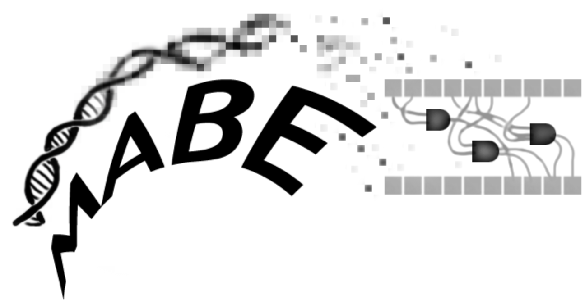

.. MABE2 documentation master file, created by
   sphinx-quickstart on Fri Jul  2 11:15:02 2021.
   You can adapt this file completely to your liking, but it should at least
   contain the root `toctree` directive.

.. 
   Less of a technical page, more of a scicomm page. Should be written for a broad general audience. Why do you want to use MABE over other softwares? What advantages does it confer? What are its possible downsides? Why should you join us?

Welcome to MABE2's documentation!
=================================

  
`Visit MABE2 on github here <https://github.com/mercere99/MABE2>`_.

Modular Agent Based Evolver (MABE) is a software framework deigned to easily build and customize software for evolutionary 
computation or artificial life. The resulting systems are useful for studying evolutionary dynamics, solving complex 
problems, comparing evolving systems, or exploring the open-ended power of evolution.

MABE version 2.0 has been re-built from scratch, using the Empirical library. The goal of this rebuild is to allow for more modular 
control, flexible agents, faster run times and portability to the web.

What is MABE and why should you use it?
---------------------------------------

The MABE software is designed for a wide variety of users including biologists, engineers, computer scientists, and other 
researchers. MABE’s primary goal is to reduce the time between thinking up a new hypothesis and generating results. 
MABE's design assumes that there are common elements (e.g., fitness functions, selection schemes, populations, etc.) in 
many evolutionary computation (EC) research projects. Leveraging these similarities allows for efficient reuse of common 
components while removing communication road blocks and simplifying the comparison, replication, and integration of 
results that would otherwise be generated by different systems. Of course, EC systems have unique behaviors and are 
required to work in different ways. MABE aims to provide sufficient structure to support portable, 
reusable, and interoperable components, while maintaining the flexibility needed to implement different EC systems. 

MABE improves efficiency through component reuse which reduces the time between thinking up a new hypothesis and generating results.
MABE also allows for the use of standardized interfaces for  `non-common elements <modules/00_module_overview.html>`_
so these elements can be used interchangeably. 

.. toctree::
   :hidden:
   :maxdepth: 2
   :caption: First Steps
   :glob:

   first_steps/*

.. toctree::
   :hidden:
   :caption: Modules Overview
   :glob:

   modules/*

.. toctree::
   :hidden:
   :caption: Evaluators
   :glob:

   evaluate/*

.. toctree::
   :hidden:
   :caption: Organisms
   :glob:

   organisms/*